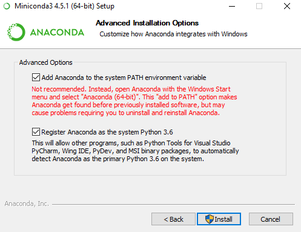
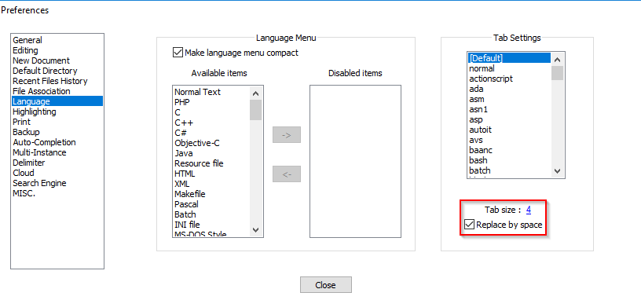
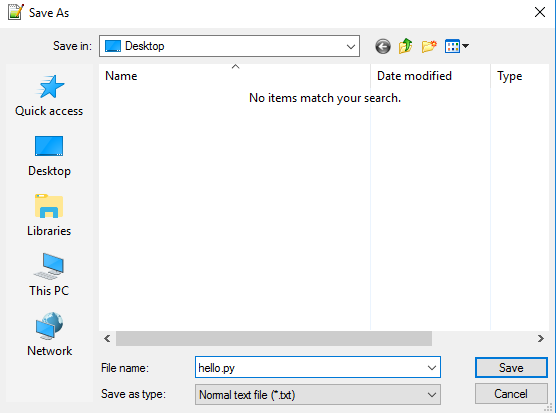
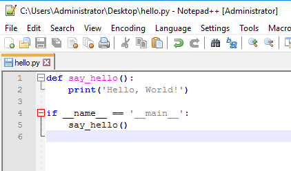
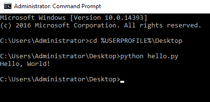

# Basic Windows Setup
This is a *very* basic guide to getting  your Windows environment prepped and
ready to run Python.

Please note that there are limitless possibilities and choices when it comes to
most of these steps.  The steps below only show one specific way to set things
up.  You are free to explore as you wish!

The steps below will have you install Notepad++ as your text editor and Miniconda
as your Python interpreter.

# Install Python
The interpreter that this guide is recommending comes from a utility called
`Miniconda`.  It's located here: https://conda.io/miniconda.html

There are many benefits to using this interpreter in Windows.  The largest
benefit is that you do not need to install a C/C++ compiler in order to
install some Python packages (e.g. `pycrypto`).

We recommend installing the latest release of Python 3.  You should only choose
Python 2 if you have a need for it.  Another great thing about `Miniconda` is
that you can start with Python 3, but you can install Python 2 at a later date.
This will use *conda environments* (not covered here; see
[the official docs](https://conda.io/docs/user-guide/tasks/manage-environments.html)).

## Installing Miniconda
1.  Download the `Python 3.6` installer from https://conda.io/miniconda.html (probably 64-bit)
1.  Run the installer
1.  Select the defaults, but stop at `Advanced Installation Options`.
    *   If this is the only version of Python installed on your computer, select
        the `Add Anaconda to the system PATH environment variable` and
        `Register Anaconda`.  
        This will allow you the greatest flexibility when running Python
    *   If this is *not* the only version of Python, select accordingly!  
    
1.  Wait for Miniconda to finish installing

You may need to log out and back in again.  YMMV.

# Text editors
The best way to write Python code is with an *enhanced* text editor.  There are
a ton of options in this realm, along with opinions.  Here are a few Windows
applications listed in order of easiest (least features) to hardest (lots of
features)
*   Easy
    *   [Notepad++](https://notepad-plus-plus.org/): Freeware, Windows only
*   Some setup effort
    *   [Visual Studio Code](https://code.visualstudio.com/): Open source, cross platform
    *   [SublimeText](https://www.sublimetext.com/): Cross platform, **not free**
    *   [Atom.io](https://atom.io/): Open source, cross platform
*   Most amount of effort
    *   [PyCharm](https://www.jetbrains.com/pycharm/download/#section=windows): Has both free and paid versions
    *   [Visual Studio](https://www.visualstudio.com/): Has both free and paid versions

If you like the command-line, there's always Vim!

For the sake of this guide, we'll use Notepad++.  If you grow out of the
limited feature set of Notepad++, we strongly recommend moving to something
else.

## Installing Notepad++
1.  Download the installer
1.  Run the installer
1.  Select all of the defaults

## Notepad++ Settings
We recommend changing your tabs so that Notepad++ will insert 4 spaces each
time you press the `Tab` key on your keyboard.  This will make you compliant
with [PEP8](https://www.python.org/dev/peps/pep-0008/#tabs-or-spaces).

*   Settings -> Preferences
*   Select `Language` and check `Replace by space` in
    the `Tab settings` section and make sure the size is set to `4`

# Using your environment
We can finally start to write some Python code!

## Create a Python script
The first step is to create a Python file.  Here's one way to do it:
1.  Open Notepad++
1.  Select `File -> New`; you should have a new tab
1.  Save the empty file with `File -> Save as...`
    *   Select the folder you want to save the file to; e.g. `Desktop`
    *   Choose a name for the file (don't use spaces or special characters)  
        For this example, let's save `hello.py`  
        
    *   **Always use an extension of `.py`**
    *   Don't worry about the `Save as type` setting
    *   Press `Save`

Saving an empty file with a `.py` extension will allow the editor to enable
syntax highlighting.  That makes things much easier to code!

Create the Python code you want to run.  Maybe this:
```python
def say_hello():
    print('Hello, World!')

if __name__ == '__main__':
    say_hello()
```

Save the file when you are done editing.

It should look something like this:  


## Run the script
1.  From the start menu, select `Command Prompt`
1.  Change to the directory you saved your script above.  Maybe:  
    `cd %USERPROFILE%\Desktop`  
    if you saved it to you Desktop
1.  Run the script with `python <scriptname>`.  For example, if you saved your
    script as `hello.py`, you would run: `python hello.py`

Here's what my command window looks like:  



# Conclusion
These directions show just one of the many ways to set up a Python environment
on Windows.  There are many more options of interpreters, text editors, and full
blown Integrated Development Environments (IDEs).  We also haven't covered any
of the 138,120 projects on [pypi.org](https://pypi.org/) (as of 7-MAY-2018)!